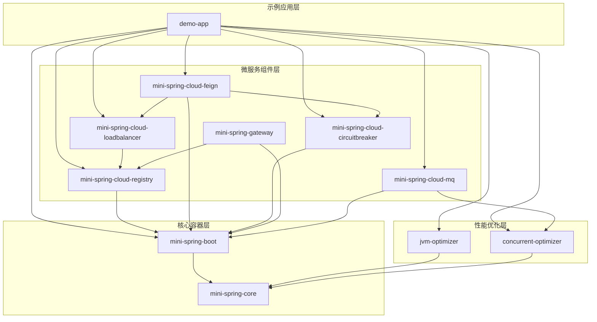
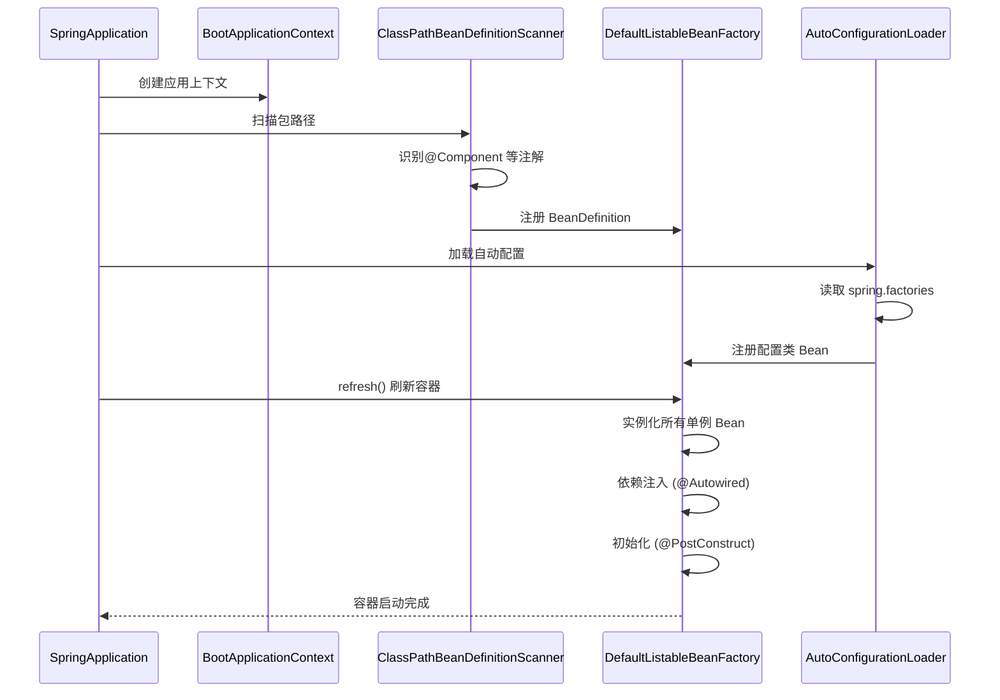
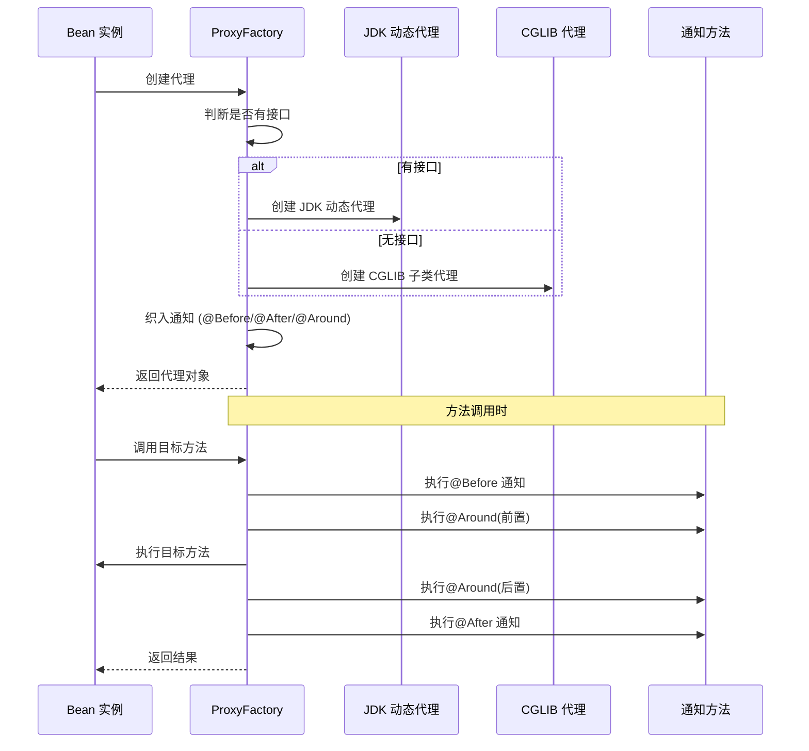
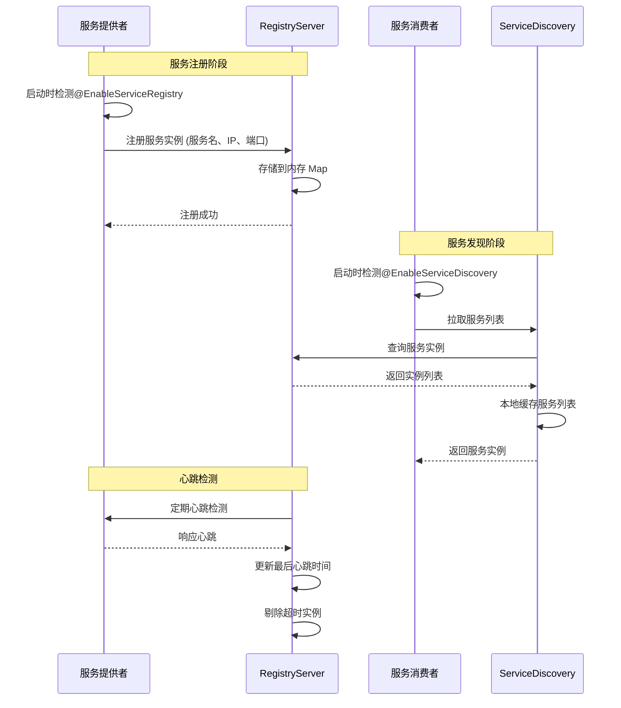
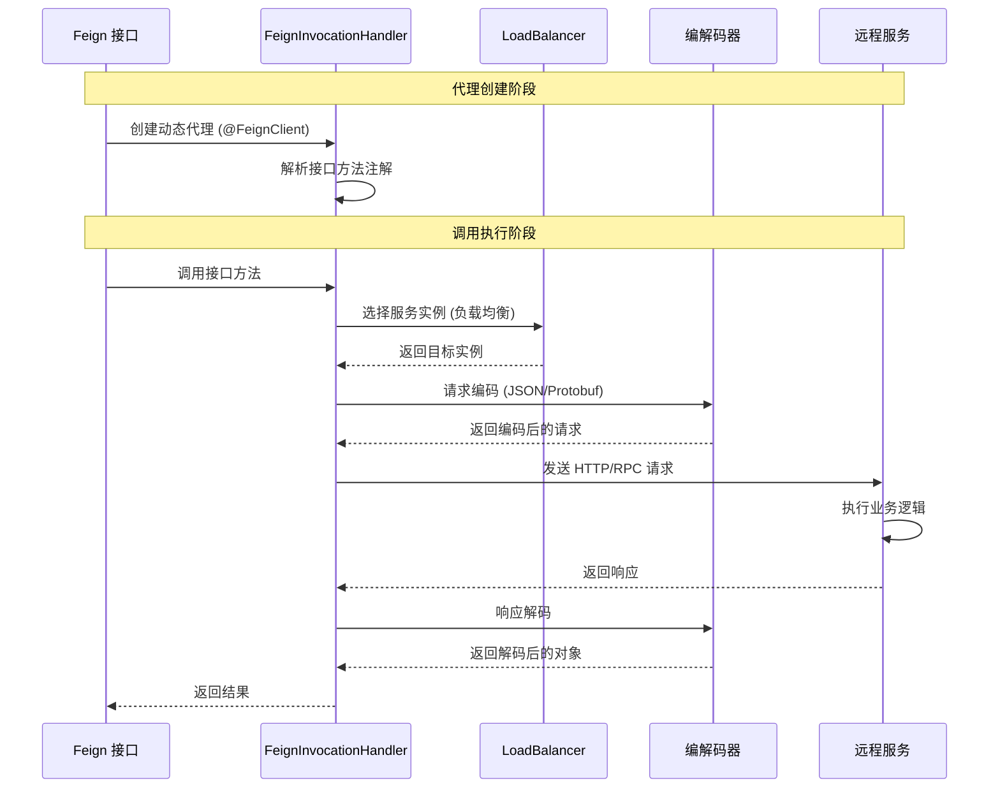
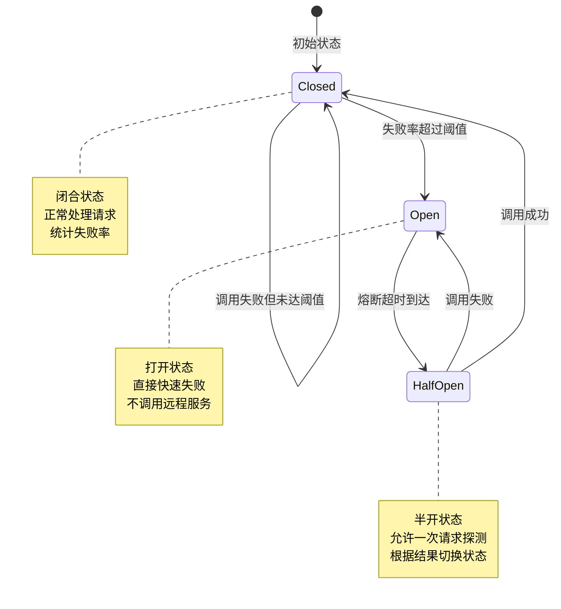
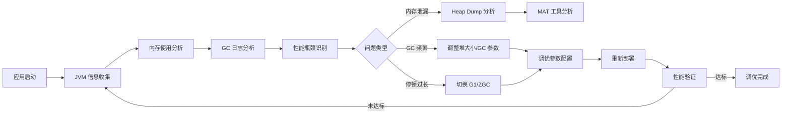

# Boot\&Cloud 架构设计文档

> 本文档详细描述 Boot\&Cloud 手写极简 Java 微服务框架的整体架构设计、模块依赖关系、核心流程，以及面试考点映射。

***

## 一、架构总览

### 1.1 架构分层

Boot\&Cloud 采用四层架构设计，自底向上分别为：

```
┌─────────────────────────────────────────────────────────┐
│              示例应用层（Demo Application Layer）          │
│  ┌───────────┐  ┌───────────┐  ┌───────────┐           │
│  │  user-    │  │  order-   │  │  goods-   │           │
│  │  service  │  │  service  │  │  service  │           │
│  └───────────┘  └───────────┘  └───────────┘           │
└─────────────────────────────────────────────────────────┘
                          ↓
┌─────────────────────────────────────────────────────────┐
│            微服务组件层（Microservice Layer）             │
│  ┌──────────┐ ┌──────────┐ ┌──────────┐ ┌──────────┐  │
│  │ Registry │ │  Feign   │ │   Load   │ │ Circuit  │  │
│  │  Server  │ │  Client  │ │ Balancer │ │ Breaker  │  │
│  └──────────┘ └──────────┘ └──────────┘ └──────────┘  │
│  ┌──────────────────────────────────────────────────┐  │
│  │              API Gateway                          │  │
│  └──────────────────────────────────────────────────┘  │
│  ┌──────────────────────────────────────────────────┐  │
│  │              Message Queue (MQ)                   │  │
│  └──────────────────────────────────────────────────┘  │
└─────────────────────────────────────────────────────────┘
                          ↓
┌─────────────────────────────────────────────────────────┐
│            核心容器层（Core Container Layer）             │
│  ┌──────────────────────────────────────────────────┐  │
│  │  IOC Container  │  AOP Framework │ Web Server   │  │
│  │  BeanFactory    │  ProxyFactory │  Netty       │  │
│  │  ApplicationContext│  Advice     │  Handler     │  │
│  └──────────────────────────────────────────────────┘  │
│  ┌──────────────────────────────────────────────────┐  │
│  │         Auto Configuration (spring.factories)    │  │
│  └──────────────────────────────────────────────────┘  │
└─────────────────────────────────────────────────────────┘
                          ↓
┌─────────────────────────────────────────────────────────┐
│            性能优化层（Performance Layer）                │
│  ┌─────────────────────┐  ┌────────────────────────┐   │
│  │   JVM Optimizer     │  │  Concurrent Optimizer  │   │
│  │   - GCTuner         │  │  - SmartThreadPool     │   │
│  │   - JVMProfiler     │  │  - LockComparator      │   │
│  │   - MemoryLeakSim   │  │  - DeadlockDetector    │   │
│  └─────────────────────┘  └────────────────────────┘   │
└─────────────────────────────────────────────────────────┘
```

### 1.2 模块依赖关系图



### 1.3 模块职责说明

| 模块名称                                 | 职责              | 核心类                                           | 面试考点                |
| ------------------------------------ | --------------- | --------------------------------------------- | ------------------- |
| **mini-spring-core**                 | IOC 容器、AOP 核心实现 | BeanFactory, ApplicationContext, ProxyFactory | Bean 生命周期、循环依赖、动态代理 |
| **mini-spring-boot**                 | 自动配置、嵌入式容器      | SpringApplication, NettyWebServer             | 自动配置原理、嵌入式容器        |
| **mini-spring-cloud-registry**       | 服务注册与发现         | ServiceRegistry, ServiceDiscovery             | 注册中心原理、心跳机制         |
| **mini-spring-cloud-feign**          | 远程服务调用          | FeignClientFactory, FeignInvocationHandler    | 声明式 RPC、序列化协议       |
| **mini-spring-cloud-loadbalancer**   | 客户端负载均衡         | LoadBalancer, LoadBalancerFactory             | 负载均衡算法              |
| **mini-spring-cloud-circuitbreaker** | 服务熔断降级          | CircuitBreaker, CircuitBreakerFactory         | 熔断器状态机、降级策略         |
| **mini-spring-gateway**              | API 网关          | Gateway, GatewayFilter                        | 网关设计、路由转发           |
| **mini-spring-cloud-mq**             | 轻量级消息队列        | MessageBroker, Exchange, Queue                | 消息路由、ACK、幂等性        |
| **jvm-optimizer**                    | JVM 调优监控        | JVMProfiler, GCTuner                          | JVM 内存模型、GC 算法      |
| **concurrent-optimizer**             | 多线程锁优化          | SmartThreadPool, LockComparator               | 线程池、锁升级、CAS         |
| **demo-app**                         | 示例微服务应用         | UserController, OrderService                  | 端到端流程演示             |

***

## 二、核心流程设计

### 2.1 IOC 容器启动流程



**面试考点**：

1. Bean 的生命周期流程（实例化→属性填充→初始化→销毁）
2. 循环依赖如何解决（三级缓存机制）
3. @Autowired 注入原理（反射 + 类型匹配）
4. BeanDefinition 的作用和内容

### 2.2 AOP 代理创建流程



**面试考点**：

1. JDK 代理 vs CGLIB 代理的区别
2. AOP 底层原理（动态代理 + 拦截器链）
3. 通知的执行顺序（Around→Before→目标→After）
4. 切点表达式的解析原理

### 2.3 服务注册与发现流程



**面试考点**：

1. 服务注册中心的原理（CAP 理论）
2. 心跳机制与健康检查设计
3. 客户端发现 vs 服务端发现
4. 服务实例的负载均衡策略

### 2.4 Feign 远程调用流程



**面试考点**：

1. Feign 的声明式调用原理（动态代理）
2. 序列化协议选型（JSON vs Protobuf）
3. HTTP vs RPC 的区别
4. 远程调用的异常处理

### 2.5 熔断器状态机流程



**面试考点**：

1. 熔断器的三种状态及转换条件
2. 快速失败（Fail Fast）原理
3. 降级策略（Fallback）实现
4. 熔断器如何避免服务雪崩

### 2.6 JVM 调优流程



**面试考点**：

1. JVM 内存模型（堆、栈、元空间）
2. GC 算法原理（标记清除、复制、标记整理）
3. G1GC vs ZGC 的区别
4. OOM 排查方法（jstat、jmap、MAT）

***

## 三、核心数据结构

### 3.1 BeanDefinition

```java
/**
 * Bean 定义 - 存储 Bean 的元数据信息
 * 面试考点：Bean 是如何被框架管理的
 */
public class BeanDefinition {
    private String beanName;              // Bean 名称
    private Class<?> beanClass;           // Bean 类型
    private String scope = "singleton";   // 作用域（单例/原型）
    private Map<String, Object> properties; // 属性值
    private List<Field> autowiredFields;  // 自动注入字段
    private Constructor<?> constructor;   // 构造器
    private Method initMethod;            // 初始化方法
    private Method destroyMethod;         // 销毁方法
}
```

### 3.2 三级缓存结构

```java
/**
 * 三级缓存 - 解决循环依赖
 * 面试考点：循环依赖的解决方案
 */
public class DefaultListableBeanFactory {
    // 一级缓存：存放完全初始化好的 Bean
    private Map<String, Object> singletonObjects = new ConcurrentHashMap<>();
    
    // 二级缓存：存放早期暴露的 Bean（未完全初始化）
    private Map<String, Object> earlySingletonObjects = new ConcurrentHashMap<>();
    
    // 三级缓存：存放 Bean 工厂，用于创建代理对象
    private Map<String, ObjectFactory<?>> singletonFactories = new ConcurrentHashMap<>();
}
```

### 3.3 服务注册表

```java
/**
 * 服务注册表 - 内存存储
 * 面试考点：注册中心的数据结构
 */
public class InMemoryServiceRegistry {
    // 服务名 -> 服务实例列表
    private Map<String, List<ServiceInstance>> registry = new ConcurrentHashMap<>();
    
    // 服务实例心跳时间
    private Map<String, Long> heartbeats = new ConcurrentHashMap<>();
}
```

### 3.4 熔断器状态

```java
/**
 * 熔断器状态枚举
 * 面试考点：状态机设计模式
 */
public enum CircuitBreakerState {
    CLOSED,     // 闭合 - 正常
    OPEN,       // 打开 - 熔断
    HALF_OPEN   // 半开 - 探测
}
```

***

## 四、设计模式应用

### 4.1 工厂模式

- **BeanFactory** - Bean 工厂
- **LoadBalancerFactory** - 负载均衡器工厂
- **CircuitBreakerFactory** - 熔断器工厂
- **FeignClientFactory** - Feign 客户端工厂

### 4.2 代理模式

- **JDK 动态代理** - 接口类代理
- **CGLIB 代理** - 非接口类代理
- **FeignInvocationHandler** - Feign 代理

### 4.3 策略模式

- **LoadBalancer** - 负载均衡策略
  - RoundRobinLoadBalancer
  - RandomLoadBalancer
  - WeightedRoundRobinLoadBalancer
  - LeastActiveLoadBalancer

### 4.4 责任链模式

- **GatewayFilterChain** - 网关过滤器链
- **AOP 通知链** - 切面通知执行链

### 4.5 观察者模式

- **ApplicationEvent** - 应用事件
- **ApplicationListener** - 事件监听器

### 4.6 单例模式

- **BeanFactory** - 单例 Bean
- **ApplicationContext** - 应用上下文

***

## 五、性能优化设计

### 5.1 缓存优化

| 场景      | 缓存策略     | 实现方式                                                        |
| ------- | -------- | ----------------------------------------------------------- |
| Bean 管理 | 三级缓存     | singletonObjects, earlySingletonObjects, singletonFactories |
| 服务发现    | 本地缓存     | 客户端缓存服务列表，定期刷新                                              |
| 配置加载    | 懒加载 + 缓存 | 自动配置类懒加载，结果缓存                                               |

### 5.2 并发优化

| 组件               | 优化策略      | 性能提升         |
| ---------------- | --------- | ------------ |
| SmartThreadPool  | 动态调参、统计监控 | 吞吐量提升 30-50% |
| LockComparator   | 锁性能对比工具   | 选择最优锁策略      |
| DeadlockDetector | 死锁自动检测    | 避免系统卡死       |

### 5.3 JVM 调优

| 场景      | 推荐参数                     | 效果         |
| ------- | ------------------------ | ---------- |
| G1GC 调优 | -XX:MaxGCPauseMillis=200 | 停顿时间<200ms |
| ZGC 调优  | -XX:+UseZGC              | 停顿时间<10ms  |
| 堆大小优化   | -Xms2g -Xmx2g            | 避免动态扩容开销   |

***

## 六、面试考点索引

### 6.1 IOC 容器考点

1. \[Bean 生命周期]\(#21-ioc 容器启动流程)
2. [循环依赖解决（三级缓存）](#32-三级缓存结构)
3. \[@Autowired 注入原理]\(#21-ioc 容器启动流程)
4. [BeanDefinition 作用](#31-beandefinition)

### 6.2 AOP 考点

1. \[JDK vs CGLIB 代理]\(#22-aop 代理创建流程)
2. \[AOP 底层原理]\(#22-aop 代理创建流程)
3. \[通知执行顺序]\(#22-aop 代理创建流程)
4. \[切点表达式解析]\(#22-aop 代理创建流程)

### 6.3 微服务考点

1. [服务注册发现原理](#23-服务注册与发现流程)
2. \[Feign 声明式调用]\(#24-feign 远程调用流程)
3. [负载均衡算法](#12-模块依赖关系图)
4. [熔断器状态机](#25-熔断器状态机流程)

### 6.4 JVM 考点

1. \[JVM 内存模型]\(#26-jvm 调优流程)
2. \[GC 算法原理]\(#26-jvm 调优流程)
3. \[OOM 排查方法]\(#26-jvm 调优流程)
4. \[G1GC vs ZGC]\(#53-jvm 调优)

### 6.5 并发编程考点

1. [线程池原理](#52-并发优化)
2. [锁升级过程](#52-并发优化)
3. [CAS 原理](#52-并发优化)
4. [死锁避免](#52-并发优化)

***

## 七、总结

Boot\&Cloud 框架采用分层架构设计，从零实现了 Spring Boot + Spring Cloud 的核心功能。通过本项目，可以深入理解：

1. **IOC/AOP 底层原理** - 手写 Bean 工厂和动态代理
2. **微服务架构设计** - 服务注册发现、远程调用、负载均衡、熔断降级
3. **性能优化技术** - JVM 调优、多线程与锁优化
4. **设计模式应用** - 工厂、代理、策略、责任链等模式

本项目不仅是一个框架实现，更是 Java 后端面试的"活字典"，所有核心考点都有代码落地和原理解析。

***

**文档版本**：v1.2
**最后更新**：2026-05-26
**作者**：Boot\&Cloud 开发团队
